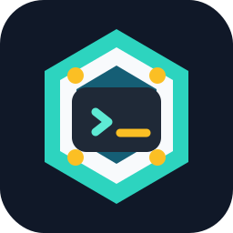

<p align="center">
  
</p>

<h1 align="center">Hermes Agent Pod</h1>

<p align="center">
  Nous Research Hermes Agent を Kubernetes Pod または Docker Compose service としてローカル起動し、localhost の OpenAI-compatible gateway 経由で Codex worker task を委譲するための検証キットです。
</p>

<p align="center">
  <a href="./README.md">English</a> | <a href="./README.ja.md">日本語</a>
</p>

<p align="center">
  <a href="https://github.com/Sunwood-ai-labs/hermes-agent-pod/actions/workflows/deploy-docs.yml"></a>
  <a href="./LICENSE"></a>
  
  
  
</p>

## ✨ 何を作るか

Hermes Agent Pod は `nousresearch/hermes-agent:latest` を扱いやすいローカル runtime として包む公開向け repo です。
Codex が主担当として host 側の file change と最終判断を持ったまま、Hermes に小さく区切った task を依頼できます。

- `sandbox-hermes` kind cluster を作り、`sandbox-hermes` namespace の `hermes-agent` Pod で Hermes を起動します。
- Docker Compose fallback として `sandbox-hermes-agent` container でも起動できます。
- Compose 版の永続 data は `data/` に置きます。
- 既定の inference provider は `gemini`、既定 model は `gemma-4-31b-it`、base URL は Google AI Studio native endpoint です。
- Gateway API は `http://127.0.0.1:8642` に公開します。
- Dashboard は `http://127.0.0.1:9119` に公開します。
- `scripts/hermes-worker` から `/v1/chat/completions` 経由で Codex-style delegation を行えます。

VitePress docs は `docs/` から公開します。

- Docs site: https://sunwood-ai-labs.github.io/hermes-agent-pod/
- Japanese docs: https://sunwood-ai-labs.github.io/hermes-agent-pod/ja/

## 🚀 Quick Start

```bash
git clone https://github.com/Sunwood-ai-labs/hermes-agent-pod.git
cd hermes-agent-pod
```

Hermes に `data/` 配下の Compose config を対話作成させる場合:

```bash
./scripts/setup.sh
```

Kubernetes Pod runtime を起動:

```bash
./scripts/kind-up.sh
```

Gemini または Google AI Studio key を kind Secret に設定:

```bash
GEMINI_API_KEY="..." ./scripts/set-gemini-key.sh
```

Pod runtime を確認:

```bash
./scripts/kind-verify.sh
```

Docker Compose fallback を使う場合:

```bash
./scripts/up.sh
./scripts/verify.sh
./scripts/down.sh
```

Pod 版と Compose 版はどちらも host の `8642/9119` を使うため、同時には起動しないでください。`scripts/kind-up.sh` は必要に応じて Compose service を止めます。

## 🧭 Codex Worker Usage

ローカル Hermes gateway に小さな task を送ります。

```bash
./scripts/hermes-worker "Hermes Pod の状態を短く要約して"
```

Host 側の text file を明示的な context として添付できます。

```bash
./scripts/hermes-worker \
  --file README.md \
  --file k8s/hermes-pod.yaml \
  "runtime 手順に抜けがないか確認して"
```

Wrapper は既定で `http://127.0.0.1:8642/v1/chat/completions` を使います。Hermes は Pod または container 内の tools を使えますが、Codex が意図的な bridge を提供しない限り host file を直接編集するわけではありません。

主な wrapper settings:

| Variable | Default |
| --- | --- |
| `HERMES_API_BASE_URL` | `http://127.0.0.1:8642/v1` |
| `HERMES_API_KEY` | `local-hermes-dev-change-me` |
| `HERMES_API_MODEL` | `hermes-agent` |
| `HERMES_WORKER_TIMEOUT` | `180` |

## 🧱 Repository Layout

```text
hermes-agent-pod/
  .github/workflows/deploy-docs.yml
  compose.yaml
  docs/
    .vitepress/config.ts
    guide/
    ja/
    public/hermes-agent-pod-icon.svg
  kind-config.yaml
  k8s/
    hermes-pod.yaml
    hermes-secret.example.yaml
  prompts/
    hermes-worker-system.md
  scripts/
    kind-up.sh
    kind-verify.sh
    kind-down.sh
    set-gemini-key.sh
    hermes-worker
    hermes-worker.py
    install-worker-persona.sh
    setup.sh
    up.sh
    down.sh
    verify.sh
  tools/
```

## ⚙️ Runtime Configuration

Compose mode の Hermes config と生成 state は `data/` に作られます。

- `data/.env`: API keys, bot tokens, API server settings
- `data/config.yaml`: model, tools, terminal backend settings
- `data/SOUL.md`: Hermes の人格・ふるまい
- `data/memories/`, `data/skills/`, `data/sessions/`: 実行中に育つ data

Kubernetes mode は次を使います。

- `k8s/hermes-pod.yaml`: ConfigMaps, PVC, Pod, Service
- `k8s/hermes-secret.example.yaml`: placeholder Secret template
- `k8s/hermes-secret.local.yaml`: local-only Secret override
- `prompts/hermes-worker-system.md`: `/opt/data/SOUL.md` に反映する worker persona

この repository は dashboard と API server を localhost にだけ公開します。外部公開する場合は reverse proxy と認証を追加してください。

## 🔐 Secret Hygiene

実 API keys, bot tokens, local runtime data は Git に入れません。

- `data/`, `.env*`, `*.local`, `k8s/hermes-secret.local.yaml` は ignore 済みです。
- `k8s/hermes-secret.example.yaml` は placeholder のみです。
- `compose.yaml` と example Secret の `local-hermes-dev-change-me` は local development 用です。
- 共有環境で使う前に placeholder key を必ず置き換えてください。

## 📚 Documentation

Docs は `docs/` で作業します。

```bash
cd docs
npm install
npm run docs:dev
npm run docs:build
```

GitHub Pages workflow は `docs/.vitepress/dist` を build して Actions から公開します。VitePress base path は `/hermes-agent-pod/` です。

## 🧪 Verification Commands

```bash
# Kubernetes runtime
./scripts/kind-up.sh
./scripts/kind-verify.sh

# Docker Compose runtime
./scripts/up.sh
./scripts/verify.sh

# Docs
cd docs
npm run docs:build
```

## 📄 License

この project は [MIT License](./LICENSE) で公開します。

## 🔗 References

- Hermes Agent docs: https://hermes-agent.nousresearch.com/docs
- Hermes Agent Docker guide: https://hermes-agent.nousresearch.com/docs/user-guide/docker
- VitePress docs: https://vitepress.dev/
