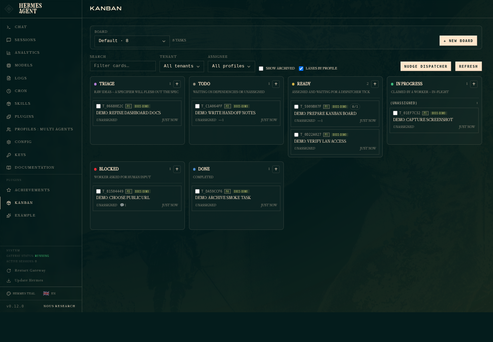

<p align="center">
  
</p>

<h1 align="center">Hermes Agent Pod</h1>

<p align="center">
  Run Nous Research Hermes Agent locally as a Kubernetes Pod or Docker Compose service, then delegate bounded Codex worker tasks through a localhost OpenAI-compatible gateway.
</p>

<p align="center">
  <a href="./README.md">English</a> | <a href="./README.ja.md">日本語</a>
</p>

<p align="center">
  <a href="https://github.com/Sunwood-ai-labs/hermes-agent-pod/actions/workflows/deploy-docs.yml"></a>
  <a href="./LICENSE"></a>
  
  
  
</p>

## ✨ What This Builds

Hermes Agent Pod is a public-facing local runtime kit for `nousresearch/hermes-agent:latest`.
It gives Codex a nearby Hermes worker that can answer bounded subtasks while Codex keeps control of host-side files and final decisions.

- Creates a `sandbox-hermes` kind cluster and runs the `hermes-agent` Pod in the `sandbox-hermes` namespace.
- Provides a Docker Compose fallback with the `sandbox-hermes-agent` container.
- Persists Compose runtime data in `data/`.
- Defaults to the `zai` inference provider, `glm-5.1` model, and the Z.AI GLM Coding Plan endpoint.
- Exposes the gateway API at `http://127.0.0.1:8642`.
- Exposes the dashboard at `http://127.0.0.1:9119`.
- Includes `scripts/hermes-worker` for Codex-style delegation through `/v1/chat/completions`.

Browsable docs are published from `docs/` with VitePress:

- Docs site: https://sunwood-ai-labs.github.io/hermes-agent-pod/
- Japanese docs: https://sunwood-ai-labs.github.io/hermes-agent-pod/ja/

## Kanban Dashboard

Recent Hermes Agent images include the SQLite-backed Kanban board. This repo exposes the dashboard surface, so you can inspect the board from the browser while keeping Codex in charge of host-side changes.



For LAN-only viewing from another PC, add these local `.env` entries. Bind only the dashboard to a trusted local interface and keep the gateway API on localhost:

```dotenv
HERMES_GATEWAY_BIND=127.0.0.1:18642
HERMES_DASHBOARD_BIND=192.168.11.200:19119
```

```bash
docker compose up -d --force-recreate hermes
```

Then open `http://192.168.11.200:19119` from the other PC. Replace the IP address with this machine's LAN address.

## 🚀 Quick Start

```bash
git clone https://github.com/Sunwood-ai-labs/hermes-agent-pod.git
cd hermes-agent-pod
```

Run the interactive Hermes setup when you want Hermes to create local Compose config under `data/`:

```bash
./scripts/setup.sh
```

Start the Kubernetes Pod runtime:

```bash
./scripts/kind-up.sh
```

Set a Z.AI GLM Coding Plan key for Compose and, when kind is available, the kind Secret:

```bash
GLM_API_KEY="..." ./scripts/set-glm-key.sh
```

Verify the Pod runtime:

```bash
./scripts/kind-verify.sh
```

Use the Docker Compose fallback instead:

```bash
./scripts/up.sh
./scripts/verify.sh
./scripts/down.sh
```

Pod and Compose runtimes both use host ports `8642` and `9119`; run only one runtime at a time. `scripts/kind-up.sh` stops the Compose service if it is already running.

## 🧭 Codex Worker Usage

Send a bounded task to the local Hermes gateway:

```bash
./scripts/hermes-worker "Summarize the current Hermes Pod status."
```

Attach host text files as explicit context:

```bash
./scripts/hermes-worker \
  --file README.md \
  --file k8s/hermes-pod.yaml \
  "Review the runtime instructions for missing operational caveats."
```

The wrapper uses `http://127.0.0.1:8642/v1/chat/completions` by default. Hermes can use tools available inside the Pod or container, but it cannot directly edit host files unless Codex provides a deliberate bridge.

Useful wrapper settings:

| Variable | Default |
| --- | --- |
| `HERMES_API_BASE_URL` | `http://127.0.0.1:8642/v1` |
| `HERMES_API_KEY` | `local-hermes-dev-change-me` |
| `HERMES_API_MODEL` | `hermes-agent` |
| `HERMES_WORKER_TIMEOUT` | `180` |

## 🧱 Repository Layout

```text
hermes-agent-pod/
  .github/workflows/deploy-docs.yml
  compose.yaml
  docs/
    .vitepress/config.ts
    guide/
    ja/
    public/hermes-agent-pod-icon.svg
  kind-config.yaml
  k8s/
    hermes-pod.yaml
    hermes-secret.example.yaml
  prompts/
    hermes-worker-system.md
  scripts/
    kind-up.sh
    kind-verify.sh
    kind-down.sh
    set-glm-key.sh
    set-gemini-key.sh
    hermes-worker
    hermes-worker.py
    install-worker-persona.sh
    setup.sh
    up.sh
    down.sh
    verify.sh
  tools/
```

## ⚙️ Runtime Configuration

Compose mode stores Hermes configuration and generated state under `data/`:

- `data/.env`: API keys, bot tokens, and API server settings
- `data/config.yaml`: model, tools, and terminal backend settings
- `data/SOUL.md`: Hermes persona and behavior
- `data/memories/`, `data/skills/`, `data/sessions/`: runtime-grown data

Kubernetes mode uses:

- `k8s/hermes-pod.yaml` for ConfigMaps, PVC, Pod, and Service
- `k8s/hermes-secret.example.yaml` as a placeholder Secret template
- `k8s/hermes-secret.local.yaml` for local-only Secret overrides
- `prompts/hermes-worker-system.md` for the worker persona copied into `/opt/data/SOUL.md`

This repository exposes the dashboard and API server on localhost only. Add a reverse proxy and authentication before any external exposure.

## 🔐 Secret Hygiene

Real API keys, bot tokens, and runtime data do not belong in Git.

- `data/`, `.env*`, `*.local`, and `k8s/hermes-secret.local.yaml` are ignored.
- `k8s/hermes-secret.example.yaml` contains only placeholders.
- `compose.yaml` and the example Secret use `local-hermes-dev-change-me` only for local development.
- Replace all placeholder keys before using a shared environment.

## 📚 Documentation

Work on the docs from the `docs/` directory:

```bash
cd docs
npm install
npm run docs:dev
npm run docs:build
```

The GitHub Pages workflow builds `docs/.vitepress/dist` and publishes it through Actions. The VitePress base path is `/hermes-agent-pod/`.

## 🧪 Verification Commands

```bash
# Kubernetes runtime
./scripts/kind-up.sh
./scripts/kind-verify.sh

# Docker Compose runtime
./scripts/up.sh
./scripts/verify.sh

# Docs
cd docs
npm run docs:build
```

## 📄 License

This project is released under the [MIT License](./LICENSE).

## 🔗 References

- Hermes Agent docs: https://hermes-agent.nousresearch.com/docs
- Hermes Agent Docker guide: https://hermes-agent.nousresearch.com/docs/user-guide/docker
- VitePress docs: https://vitepress.dev/
